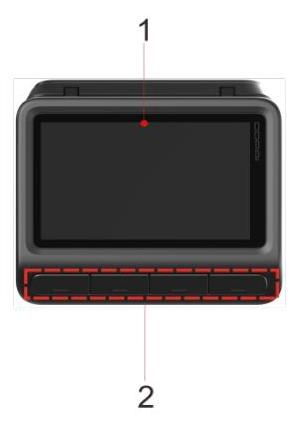
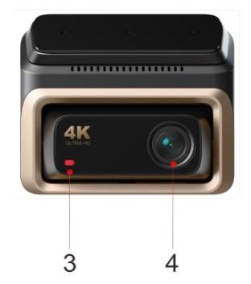
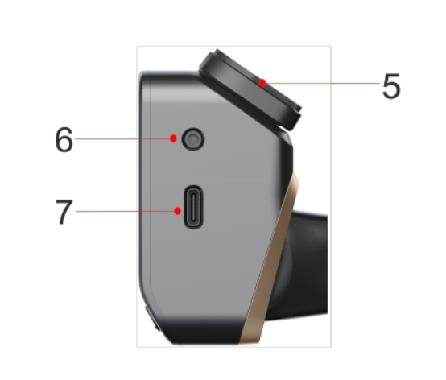
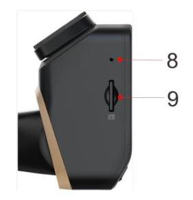

# 1.1 产品外观

<table>
  <tr>
    <td>No.</td>
    <td>部件</td>
  </tr>
  <tr>
    <td>1</td>
    <td>显示屏(非触控)</td>
  </tr>
  <tr>
    <td>2</td>
    <td>功能按键</td>
  </tr>
  <tr>
    <td>3</td>
    <td>状态指示灯</td>
  </tr>
  <tr>
    <td>4</td>
    <td>镜头</td>
  </tr>
  <tr>
    <td>5</td>
    <td>胶贴底座 (可拆卸)</td>
  </tr>
  <tr>
    <td>6</td>
    <td>后摄像头插孔</td>
  </tr>
  <tr>
    <td>7</td>
    <td>Type-C 接口</td>
  </tr>
  <tr>
    <td>8</td>
    <td>麦克风</td>
  </tr>
  <tr>
    <td>9</td>
    <td>TF 卡槽</td>
  </tr>
</table>

