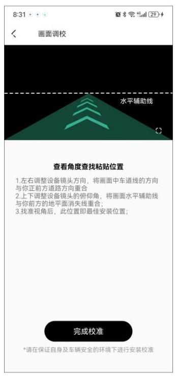

# 2.1 接点烟器取电

将车载充电器插入点烟器中,通过电源线连接车载充电器和记录仪,电源线大部分会嵌入汽车塑料护板中,小部分裸露在车内,此接线方法操作简单易行。

## 第 1 步:擦拭前挡风玻璃

使用干净的软布擦拭前挡风玻璃,以确保支架能够牢固黏贴。

## 第 2 步:接通电源

将车载充电器插入点烟器中后,使用标配 Type-C 电源线连接车载充电器和记录仪。 汽车打火启动后,记录仪通电将自动开机,并发出开机提示音"Hello,盯盯拍"。

## 第 3 步:确定记录仪安装位置及调整镜头角度

① 请参考第三章 "APP 连接",完成盯盯拍 App 与记录仪连接后,进入盯盯拍 App,选择 "设备" > "设备设置" > "ADAS 智能辅助驾驶" > "ADAS 安装位置调校"。

② 选择 "前往实时预览" > "进入实时预览" 进入校准界面。请按照屏幕上的操作指引进行记录仪安装。

③ 安装完成后,点击"完成校准"。

## 第 4 步:固定记录仪

① 确定记录仪安装位置后,将静电贴粘在安装位置处。

② 撕下底座上 3M 胶薄膜,通过 3M胶把设备粘在静电贴中央。

**注 意**

粘贴时请注意方向和位置,3M 胶为一次性物品,请确认记录仪拍摄角度正确的情况下粘贴。

## 第 5 步:布线

如下图所示,请将电源线从点烟器排至记录仪固定位置处,可使用随附的撬线棒将电源线隐藏于汽车塑料护板中。

**注 意**

您汽车上的点烟器位置可能有所不同,上图仅供参考,请以实际为准。