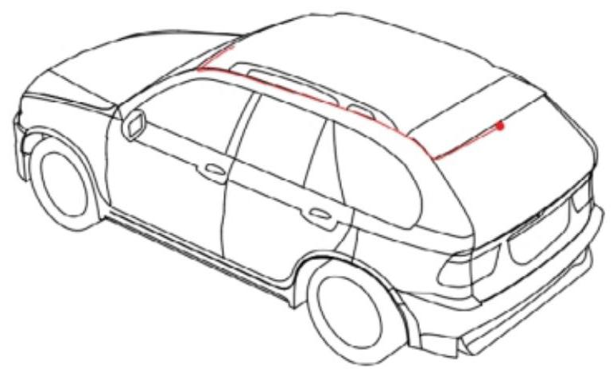
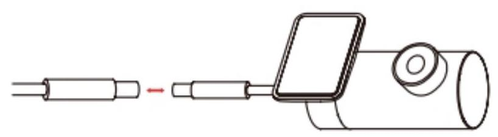
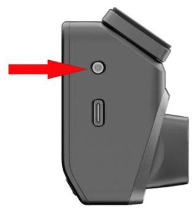

# 2.3 连接后摄像头 (选配)

第 1 步:清洁后挡风玻璃,后摄像头安装位置请参考下图。

第 2 步:连接后摄像头与电源线。

第 3 步:将后置电源线连接至主机上的后摄像头插孔。

**注 意**

请确保电源线完全插入孔位。

第 4 步:将后置电源线从主机位置排至汽车后录摄像头安装位置,线缆走势如上图所示。

第 5 步:撕掉红色背胶,调节后置摄像头视野后,再将后置摄像头固定至后挡风玻璃内壁。

**注 意**

请务必按照贴纸上的指示方向进行安装,并确保镜头朝向后挡风玻璃。