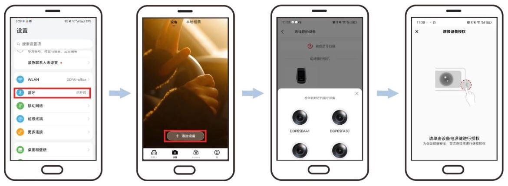
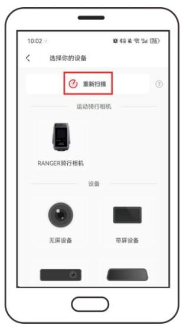
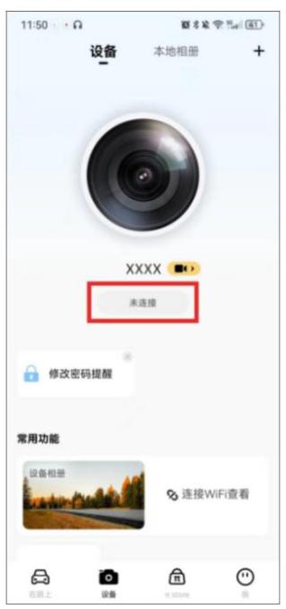
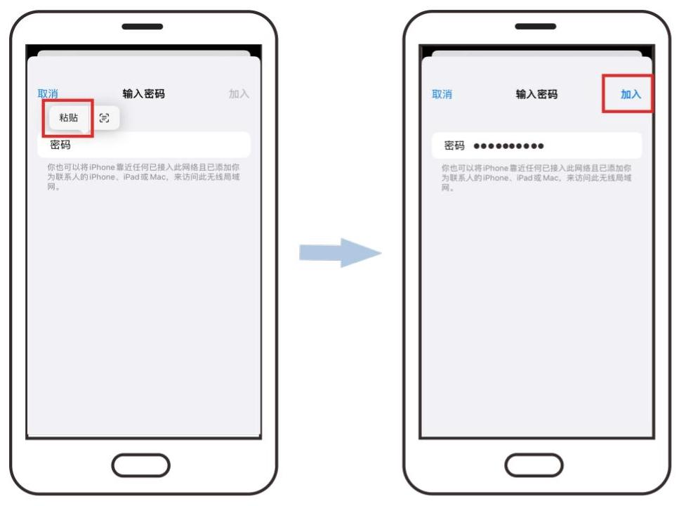
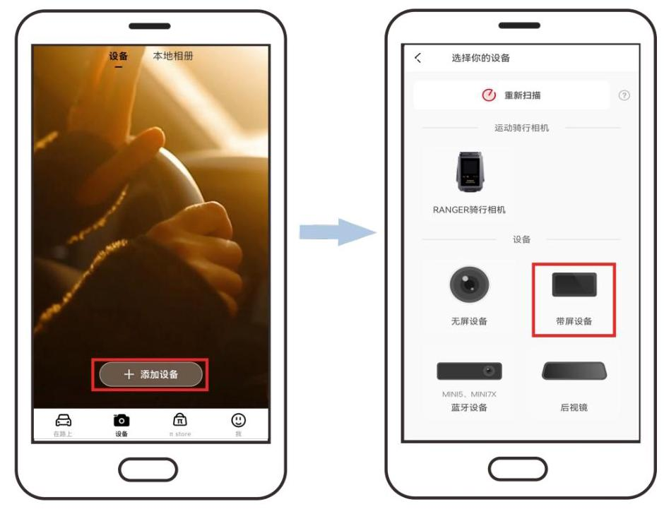
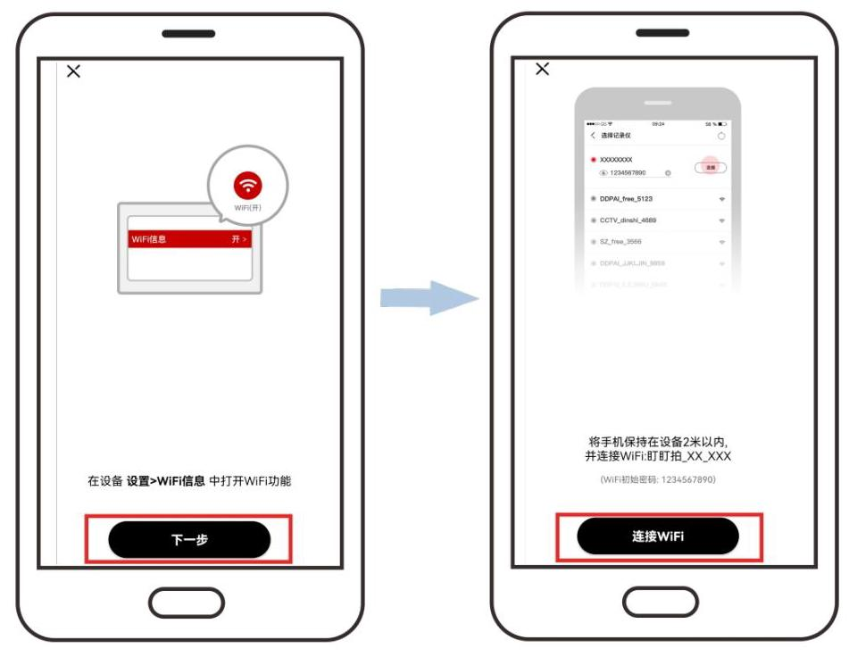
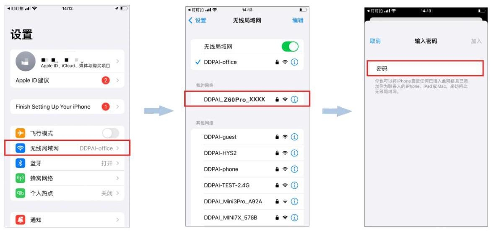
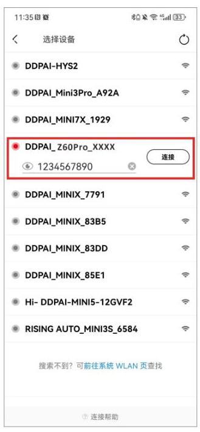

# 3.2 蓝牙连接

① 设备开机,请根据开机页面指示进行操作,如下图所示。

② 开启手机蓝牙。

③ 打开"盯盯拍"App,进入"设备"界面,点击"+添加设备"。

④ 在搜索出来的蓝牙列表中选择当前设备名称(DDP19XXXX)。

⑤ 点击设备最右侧的确认按键进行授权。

**注 意**

若蓝牙设备搜索失败,可以点击"重新扫描"再次进行蓝牙设备搜索。

**注 意**

非首次连接情况下,设备开机后,打开 App ,进入"设备"界面,点击"未连接"按钮, 可直接与设备进行蓝牙连接。

**注 意**

- 设备一次只能与一台手机进行蓝牙连接。

- 当设备已经被一台手机蓝牙连上后,必须通过关闭该手机蓝牙/App 上删除设备/设备复位才能让另一台手机通过蓝牙与设备连接。

**注 意**

若需查看设备相册,设备设置,实时录像画面或下载视频,需先与设备进行 Wi-Fi 连接。

## 苹果手机

1. 请根据 App 页面指示进行操作,跳转至手机设置界面,点击 "无线局域网",选择当前设备名称(DDPAI_Z60Pro_XXXX)。

2. 直接粘贴 Wi-Fi 密码 (已自动复制) 进输入框, 或者您可以选择自己手动输入默认密码: 1234567890,然后点击"加入"。

## 安卓手机

Wi-Fi 功能正常开启的情况下,无需用户手动连接,系统将会自动连接。 

**注 意**

部分安卓手机(如 OPPO, vivo)进行 Wi-Fi 连接时,将跳转至手机设置 WLAN 界面,点击设备型号,耐心等待片刻,连接成功后将自动跳转回 App 界面。

若您的手机无法与设备进行蓝牙连接,您可以参照以下步骤,直接与设备进行 Wi-Fi 连接。

① 打开"盯盯拍"App,进入"设备"页面,点击"+ 添加设备",然后选择"带屏设备"。

② 依次点击 "下一步" > "连接 Wi-Fi" 。

- 苹果手机: 在手机设置界面,进入 "无线局域网" 界面,选择当前设备 Wi-Fi 名称 "DDPAI_Z60Pro_XXXX",输入密码(初始密码:1234567890)后,点击"加入"。

- 安卓手机: 在 Wi-Fi 列表中,选择当前设备 Wi-Fi 名称 "DDPAI_Z60Pro_XXXX" , 输入密码(初始密码:1234567890)后,点击"连接"按钮。

