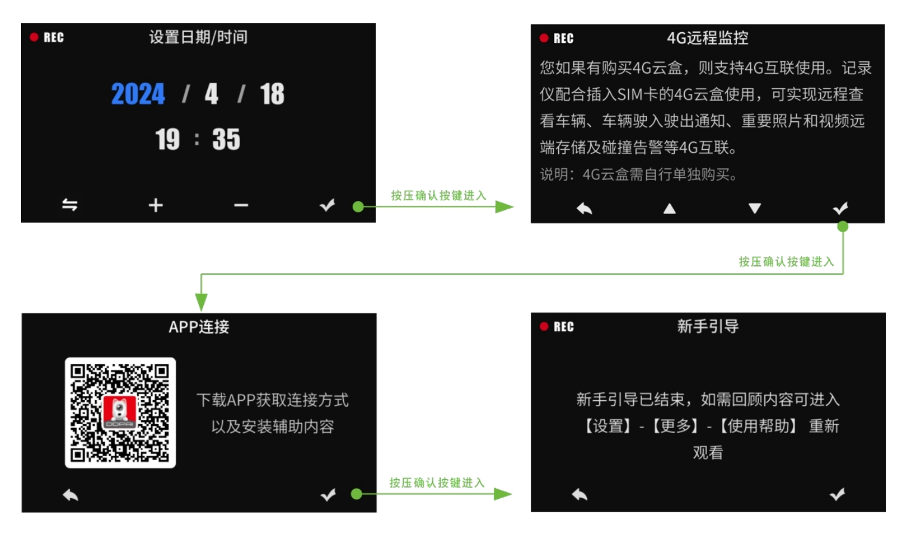
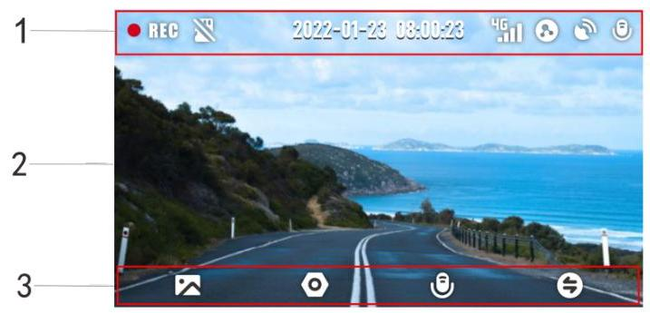
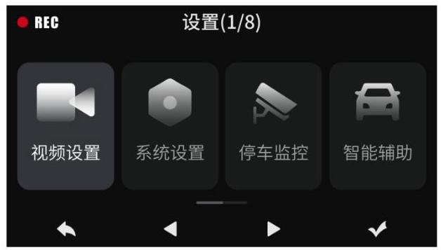
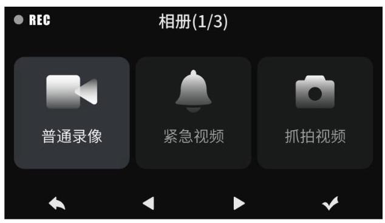

#### 4.1.1 引导界面

设备通电后,您将进入开机引导页面,请根据页面指示进行操作,具体 App 连接授权步骤参考第三章 “App 连接”。

#### 4.1.2 主界面

设备通电后,您将直接进入设备主界面,主界面包含顶部状态栏、实时预览区以及按键功能区。

1. 顶部状态栏:显示录制状态、日期时间、4G 信号、πLink 组网状态、GPS、录音状态等信息。

2. 实时预览区:实时播放记录仪录制视频。

3. 按键功能区:按压对应功能按键进入相册、设置、打开/关闭录音、亮屏/息屏或切换镜头。

## 注 意

首发版本设备端暂不支持拍πLink 功能,需等待后续 OTA 升级支持。

#### 4.1.3 设置界面

从主界面按压 (设置)按键进入设置界面,在此界面您可对记录仪的各项参数进行设置。

#### 4.1.4 相册界面

从主界面按压(相册)按键进入设备相册,您可以查看行车记录仪记录的所有视频或图片文件。

<table>
<tr>
<td>相册文件</td>
<td>描述</td>
</tr>
<tr>
<td>录像</td>
<td>所有正常录制的视频文件都将保存在“录像”文件夹中。</td>
</tr>
<tr>
<td>紧急</td>
<td>记录仪处于工作状态时,检测到发生碰撞(如车辆紧急刹车 或碰撞等紧急情况),会触发拍照,生成一张紧急照片和一 段紧急关联视频,这些文件都将保存在“紧急”文件夹中。</td>
</tr>
<tr>
<td>抓拍</td>
<td>当您对行车记录仪麦克风说“我要拍照”来拍摄照片时,抓 拍照片以及关联短视频文件将保存在“抓拍”文件夹中。</td>
</tr>
</table>