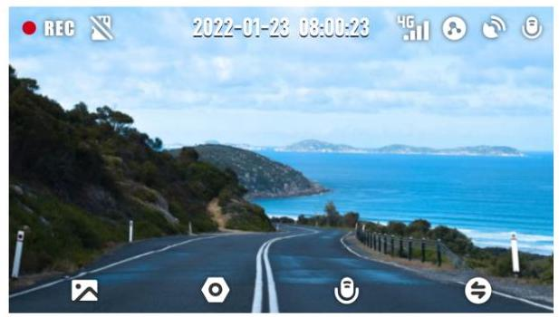
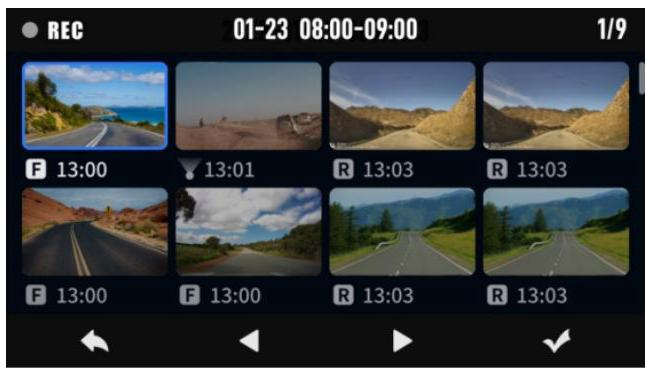

### 5.1.1 视频预览

方式一:在 Z60Pro设备主界面进行视频预览

## 方式二:在 “盯盯拍” App 上进行视频预览

App 连接记录仪成功后,进入实时预览界面,点击  (横屏)按钮或水平旋转手机(需开启手机自动旋转功能),实时画面将自动切换至全屏预览模式。

## 注 意

当前为预览画质,原画质视频请下载观看。

### 5.1.2 视频回放

## 方式一:在 Z60Pro 设备上进行回放

按压设备 [4] (相册) 按键,进入设备相册,选择视频文件进行回放.

## 方式二:在 “盯盯拍” App 上进行视频回放

1. App 连接记录仪成功后,进入实时预览界面；

2. 拖动进度条,选择需要查看的时间起点；

3. 点击缩略图或静待 5 秒钟,即可开始播放先前的录制视频。

## 注 意

时间轴上有对应颜色标记,具体含义见下表。

<table>
<tr>
<td>颜色标记</td>
<td>含义</td>
</tr>
<tr>
<td>  </td>
<td>视频由紧急事件触发 (例如车辆突然刹车或碰撞)</td>
</tr>
<tr>
<td>  </td>
<td>视频在停车监控模式下录制</td>
</tr>
</table>

### 5.1.3 视频下载

## 方法一:

1. 在盯盯拍 App 进入实时预览界面,拖动进度条,选择需要下载的时间起点。

2. 点击下载按钮开始下载,下载完毕后,文件将保存至本地相册,可分享、删除。

## 注 意

每段视频长度范围为:5 秒钟至 3 分钟。

## 方法二:

1. 进入实时预览界面,点击 (设备相册)；

2. 长按文件进行选择状态,勾选所需下载的视频文件,点击下载按钮。