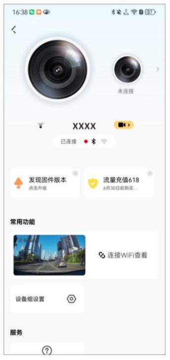

Z60 Pro 支持πLink 功能,可实现多设备互联。当您购买了另一台支持πLink 功能的设备, 两台设备组网成功后,您可以在一部手机上同时查看这两台设备的实时录像,并进行视频播放、下载等操作。

## 注 意

App 端支持πLink 功能,但首发版本设备端暂不支持,后续 OTA 升级后即可支持。

### 5.10.1 组网连接

## 注 意

- πLink 功能目前最多支持两款设备同时组网。
- 组网前请确保两台设备均已正常开机。
- 组网连接时区分 “主设备” 与 “从设备” 。主设备一般作为前录摄像头,从设备一般作为后录摄像头, Z60 Pro 与其它设备组网连接时默认为“主设备”。

1. 两台设备通电开机。
2. 请按照以下步骤将这两台设备分别通过蓝牙添加至“盯盯拍”App 设备列表。

① 开启手机蓝牙。
② 打开“盯盯拍”App,进入“设备”界面,点击“+添加设备”。
③ 在搜索出来的蓝牙列表中选择当前设备名称(DDP19XXXX)。

④ 单击机身上的功能按键进行授权。
⑤ 第一台设备连接成功后,点击“设备”界面右上角“+”添加第二台设备,具体连接方法参考上述步骤①~步骤④。

3. 在 “设备” 界面,您可以看到这两台已添加的设备,点击 “πLink” 按钮,弹出 “设备组合" 弹窗后,再点击 "组网" 按钮。

4. 组网成功后, App“设备”页面将出现这两台设备的产品图。

### 5.10.2 切换设备

您可以通过点击 (切换)按钮或者点击非当前设备的产品图片可进行切换。切换设备后,“设备” 界面将显示当前设备的各功能详情。

### 5.10.3 设定方位标识

您可以根据目前设备的安装情况设置方位标识,示意当前设备的镜头朝向。点击“设备组设置” > “设备方位标识”,勾选标识后点击“确定”按钮。设置完成后,在设备相册等页面将会显示对应标识,方便您更好地找到相关设备录制的文件。

## 注 意

仅支持修改从设备的方位标识,主设备(朝前设备)方位标识默认向前。

### 5.10.4 解除组合

在“设备”界面点击“解除组合”按钮。解除组合后,录像文件将分离到各所属设备相册中去。

