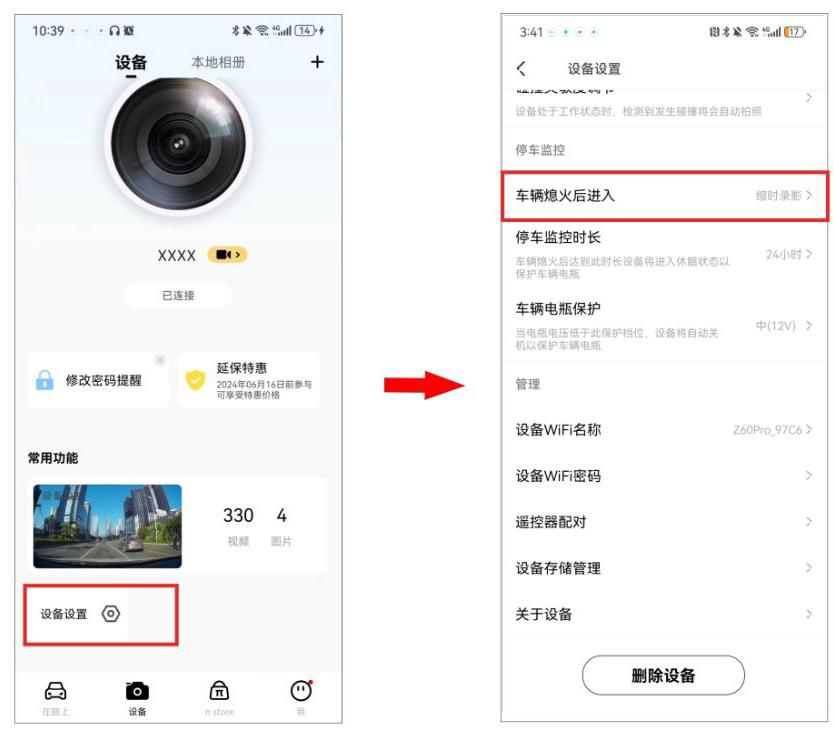

当您选配降压线进行取电,可实现停车监控功能。车辆熄火后,记录仪将自动进入监控录制模式,若有异常碰撞将自动记录。您可对停车模式、停车监控时长以及车辆电瓶保护电压值进行设置。

① 手机盯盯拍 App 连接记录仪后,进入盯盯拍 App,进入 “设备” 界面,点击 “设备设置” > “车辆熄火后进入”。

② 选择一种停车监控模式。

## 缩时录像

- 汽车熄火后进入缩时录影,达到设置时长后进入休眠状态(休眠过程中支持碰撞唤醒), 当检测到低压时关机,关机后只能通过打火唤醒。

● 若在缩时录像过程中发生碰撞,则拍摄照片(文件名以 “G” 开头, “X” 结尾),同时记录碰撞事件(在下次打火时发出提示音),然后录制 2 分钟的普通视频再切换回缩时录像模式。

- 缩时录像模式下将自动开启黑光夜视功能(AIISP),确保夜间停车录像画面更清晰。

## 普通录像

汽车熄火后维持普通录影,达到设置时长后进入休眠状态(休眠过程中支持碰撞唤醒),当检测到低压时关机,关机后只能通过打火唤醒。

## 休眠

- 汽车熄火后进入休眠状态,若发生碰撞后,则进入唤醒录像模式,进行 30 秒普通录像, 然后继续休眠,检测到低压后关机,关机后只能通过打火唤醒。

- 普通录像过程中若再次发生碰撞,则拍摄照片(文件名以“G”开头,“L”结尾)； 若持续发生碰撞,则当普通录像长达 2 分钟后,切换为缩时录像；缩时录像过程中,30 秒内若无碰撞,则重新进入休眠,若持续有事件触发,则一直进行缩时录像,工作时间不做限制,通过降压线低压保护来确保电瓶不馈电。

## 注 意

此功能需选配降压线实现。