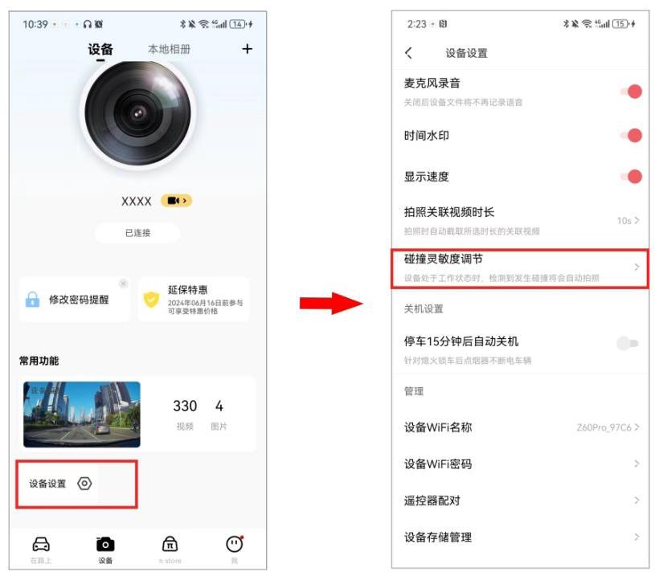

记录仪处于工作状态时,当检测到发生碰撞(如车辆急刹车或碰撞等紧急情况),会触发拍照,生成一张紧急照片和一段紧急关联视频,并单独存放,不会被正常记录的文件循环覆盖。

### 5.4.1 设置碰撞感应灵敏度

记录仪碰撞灵敏度越高,越容易触发拍照；记录仪灵敏度越低,越不容易触发拍照。

记录仪默认碰撞灵敏度为“中”,支持“高”、“中高”、“中”、“中低”、“低”、“关闭”、“自定义”七个档位的碰撞感应灵敏度选择。

选择好合适的碰撞感应灵敏度,车辆碰撞或急刹车等紧急情况时,会触发记录仪拍照,生成一张紧急照片和视频；若选择关闭,车辆碰撞或急刹车等紧急情况时,则无照片和视频生成。 您可以通过以下方法切换记录仪的碰撞感应灵敏度。

① 手机盯盯拍 App 连接记录仪后,进入盯盯拍 App,进入 “设备” 界面,点击 “设备设置” > "碰撞灵敏度调节"。

② 选择“行车中”或“停车监控中”,设置合适的碰撞感应灵敏度。

### 5.4.2 设置紧急关联视频时长

记录仪默认紧急关联视频时长为“10s”,支持“10s”、“20s”、“30s”三个紧急关联视频时长选择。您可以按照以下步骤对紧急关联视频时长进行设置。

① 手机盯盯拍 App 连接记录仪后,进入盯盯拍 App,进入 “设备” 界面,点击 “设备设置” > "拍照关联视频时长"。

② 选择您所需的关联视频时长。

- 10s : 记录仪检测到碰撞后,会生成一段拍照时刻前后各 5 秒的紧急关联视频。

- 20s:记录仪检测到碰撞后,会生成一段拍照时刻前后各 10 秒的紧急关联视频。

- 30s:记录仪检测到碰撞后,会生成一段拍照时刻前后各 15 秒的紧急关联视频。

- 关闭:记录仪检测到碰撞后,还是会生成一段拍照时刻前后各 5 秒的紧急关联视频。