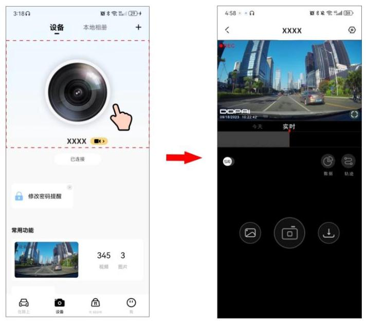
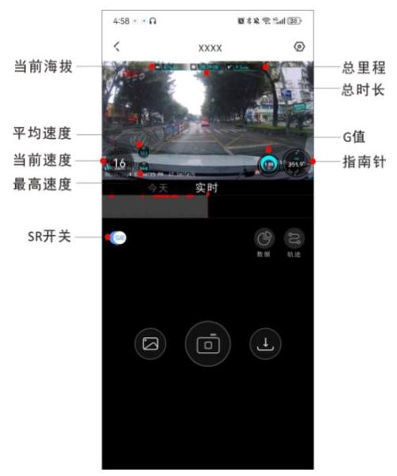
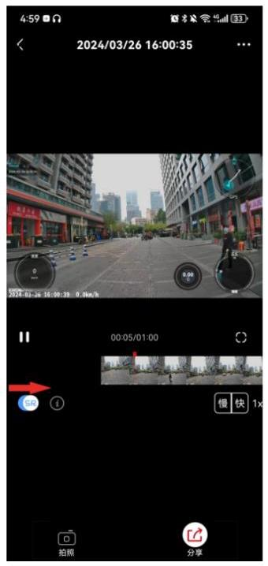

记录仪内置 SR 功能,可将行车数据叠加到实时预览/回放画面中,生成专属酷炫轨迹界面, 给您更好的视觉和内容分享体验。

### 5.5.1 查看 SR 实时效果

1. 手机盯盯拍 App 连接记录仪后,进入盯盯拍 App,点击虚线框出的区域(见下图),您可进入实时预览界面。

2. 在预览画面左下方有一个 “SR” 开关,打开后,可以在预览或回放界面查看 SR 实时效果。

## 注 意

在预览界面查看的是 SR实时效果,非 SR最终效果。

3. 您也可以点击预览界面右下方的“数据”,查看当前速度、总行车时间等行车数据。

### 5.5.2 生成及分享 SR 视频

1. 进入盯盯拍 App,点击 “本地相册”,选择需要分享的视频后,打开画面左下角 “SR” 开关,视频中叠加 SR 数据。

2. 点击下方 “分享” ,可进行视频裁剪、SR 风格选择、配乐。

3. 完成编辑后,点击“确定”,可分享至盯盯拍社区、微信、微博等社交媒体平台。 

## 注 意

SR 数据仅供参考,数据的准确性与行车记录仪的安装位置密切相关。