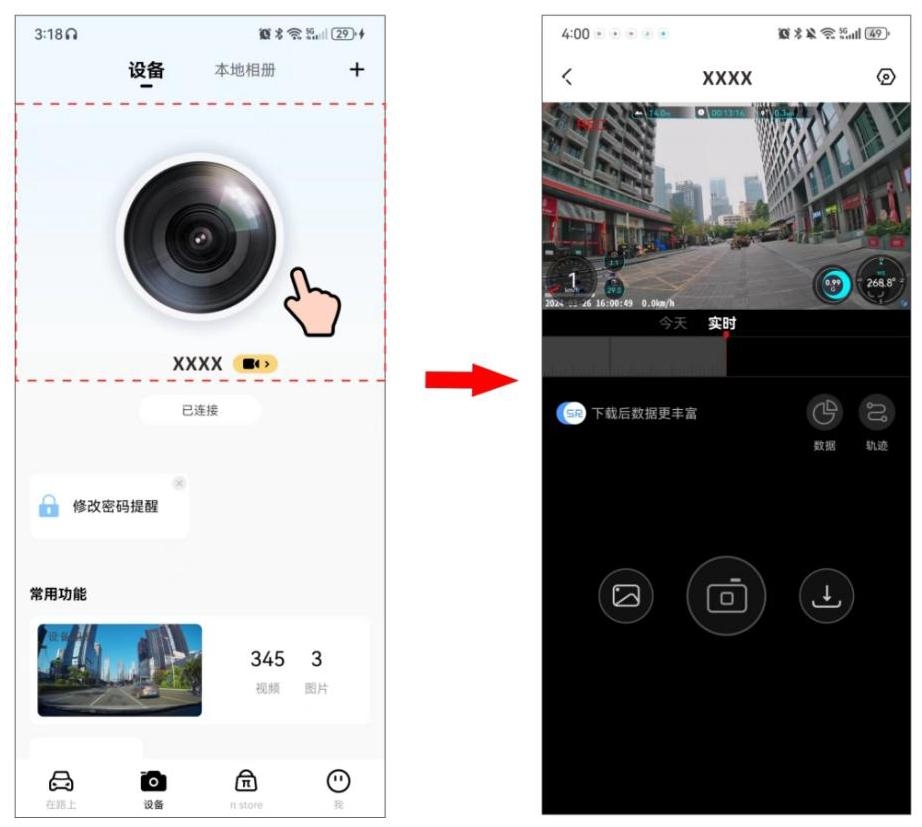
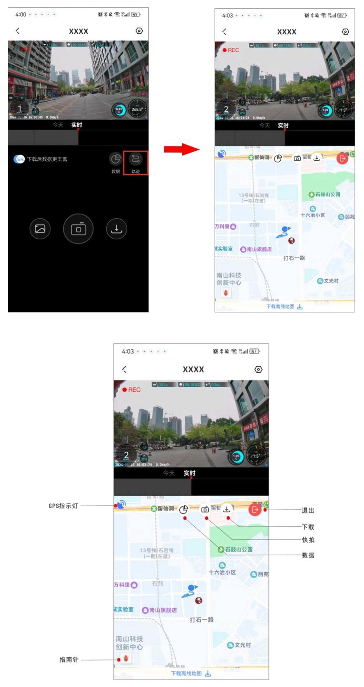
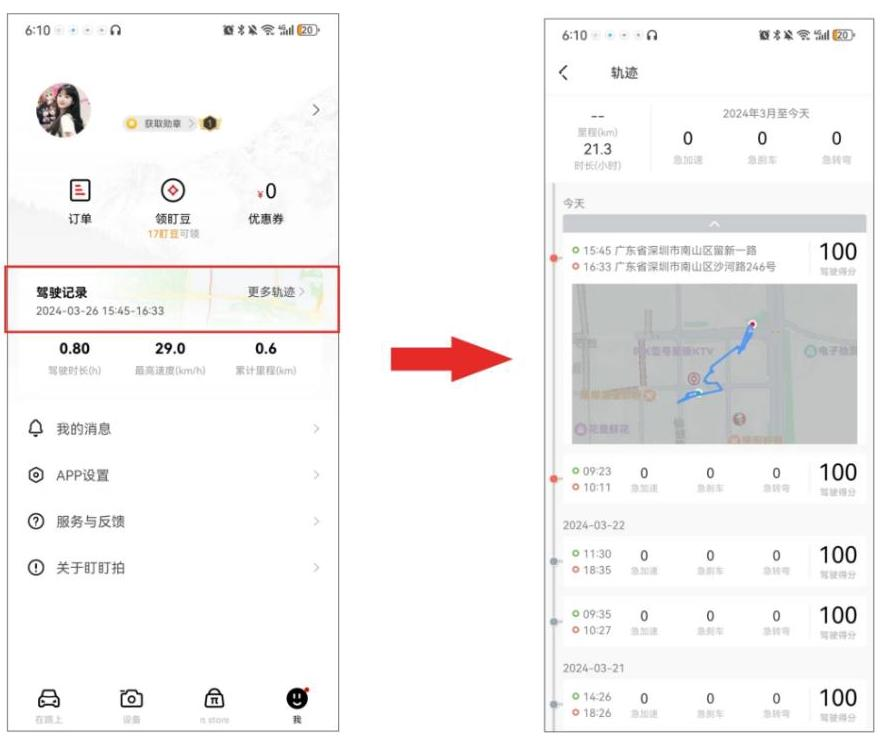
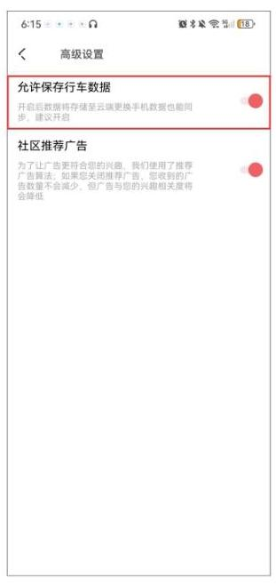

行车记录仪支持 GPS 功能,默认开启。当行车记录仪处于室外空旷区域时,可接收 GPS 信号。成功定位后, GPS 信息将记录在您录制的视频中。您可以在盯盯拍 App 中查看时间、 速度、海拔、方向、行驶轨迹等各种信息。

## 注 意

在人口密集的住宅区、地下停车场、隧道、阴天等情况下, GPS 信号接收会受到影响。

#### 5.6.1 实时查看行车轨迹和当前位置

1. 请参考第三章 “APP 连接”,进行手机盯盯拍 App 与手机连接。

2. 手机盯盯拍 App 成功连接记录仪后,点击虚线框区域(见下图)可直接进入实时预览界面。

3. 点击 “轨迹”,可实时查看行车轨迹和当前位置。

#### 5.6.2 查看所有行车轨迹

打开盯盯拍 App,点击“我”> “驾驶记录”,您可查看所有行车轨迹记录。

## 注 意

- 您需要先登录盯盯拍 App 才可以查看行车记录。

- 建议您进入盯盯拍 App,点击 “我” > “APP 设置” > “高级设置” > 打开“允许保存行车数据”,开启后行车数据将存储至云端,后续更换手机或者重装 App,行车数据也能同步。

