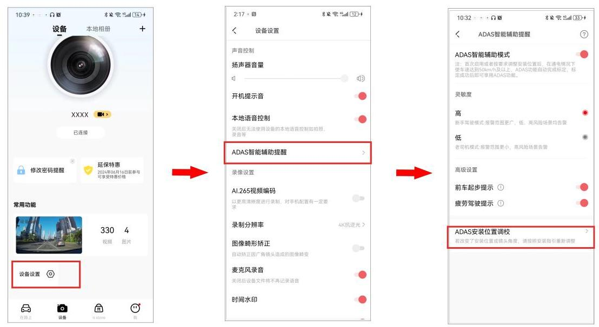
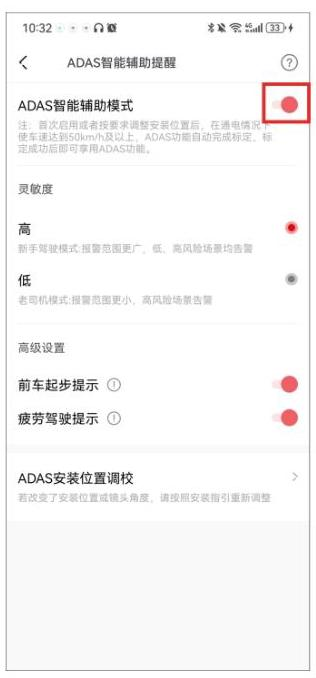

ADAS 智能驾驶辅助支持路况变化检测,并为您提供驾驶提醒,包括前车启动、前车距离过近、行人靠近、请勿压线行驶以及疲劳驾驶的语音提醒。

## 注 意

首发版本设备的 ADAS 功能默认关闭,手机 App 与设备连接后该功能也将自动关闭。后续 OTA 升级将优化此功能体验,敬请期待。

### 5.7.1 标定 ADAS 智能驾驶辅助

首次开启 ADAS 智能驾驶辅助, ADAS 需要进行标定,以适配不同车型。

① 参考第三章节 APP 连接,完成盯盯拍 App 与记录仪连接后,进入盯盯拍 App,选择“设备" > "设备设置" > "ADAS 智能辅助驾驶" > "ADAS 安装位置调校"。

② 选择 “前往实时预览” > “进入实时预览” 进入校准界面,请按照屏幕上的操作指引进行记录仪安装。

③ 安装完成后,点击“完成校准”。

## 注 意

为了保证更准确的 ADAS 体验,当行车记录仪安装位置或镜头角度发生变化时,需要重新标定 ADAS。

### 5.7.2 开启 ADAS 智能驾驶辅助模式

手机盯盯拍 App 连接记录仪后,进入盯盯拍 App,点击“设备设置”,开启“ADAS 智能辅助模式”。

- 开启 “ADAS 智能辅助模式”:在特定车速和场景下将会触发对应的语音提示,用于辅助驾驶。具体语音提示以及触发条件如下:

  - 前车距离过近预警:当前车距离过近时,进行语音提醒“前车距离过近”,防止追尾。
  - 请勿压线预警:当车辆行驶偏离车道线,进行语音提醒“请勿压线行驶”。
  - 前车启动预警:停车状态下,当识别到前车起步,进行语音提醒“前车启动”。
  - 行人靠近预警:当行车途中检测到突然出现在车前的行人,进行语音提醒“行人靠近”, 避免交通事故。
  - 疲劳驾驶提醒:当车辆连续行驶 4 小时,进行语音提醒 “您已持续开车 4 个小时,请注意休息”,避免疲劳驾驶。

- 关闭 “ADAS 智能辅助模式”:无智能辅助语音提醒。

### 5.7.3 设置 ADAS 灵敏度

“ADAS 智能驾驶辅助”开关开启后,可设置各项智能提醒的识别灵敏度(包含“前车距离过近”、“请勿压线行驶”、“前车启动”以及“行人靠近”),选择调高或者调低智能提醒的触发率。

- 选择“高”:其告警提醒范围更广,告警范围广,更易触发告警,适合新手驾驶选择。
- 选择 “低”:其报告警范围更小,仅高风险场景告警,适合老司机驾驶选择。
- 选择 “中”:适中模式,告警范围适中。

### 5.7.4 设置疲劳驾驶语音提醒

“ADAS 智能驾驶辅助”开关开启后,可选择开启/关闭疲劳驾驶语音提醒。开启后,用户在长时间驾驶时,会给出疲劳驾驶智能语音提示,提醒用户休息或提高警惕。