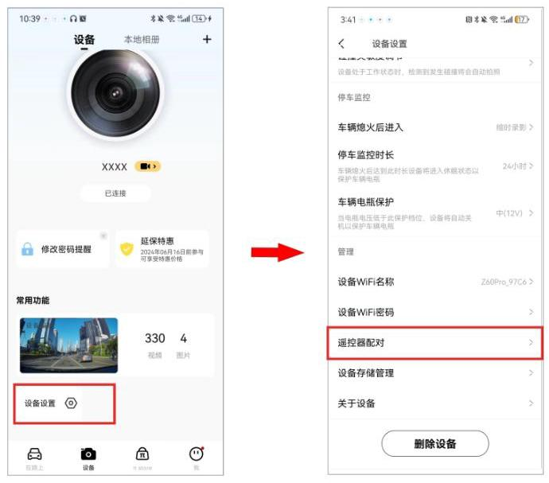
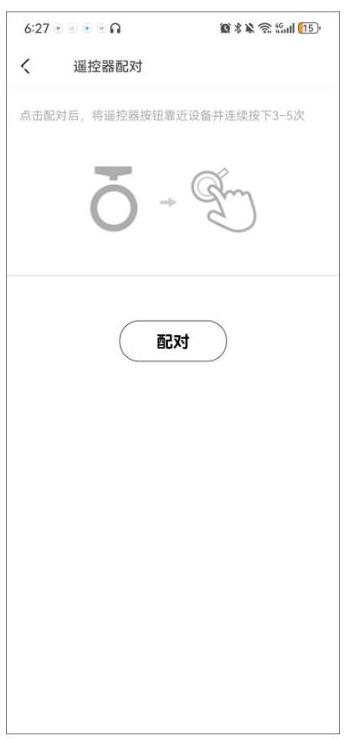
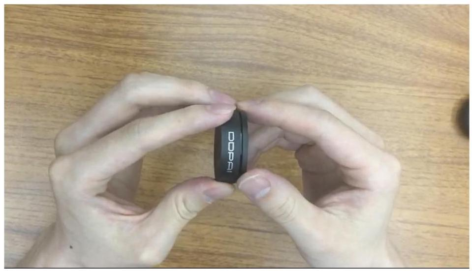
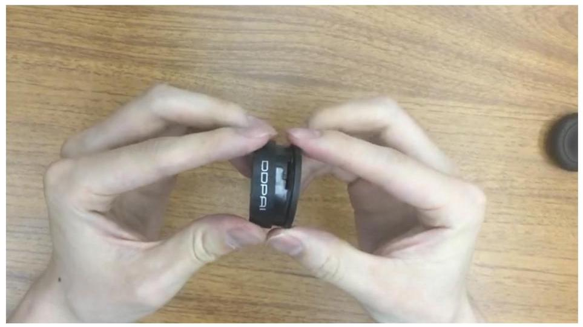

当行车记录仪与其无线遥控器完成配对后,行车过程中遇到想要抓拍照片,可通过按压无线遥控器,抓拍一张当前的行车画面,抓拍时记录仪会发出拍照提示音。此时若打开关联视频功能,还会生成一段抓拍照片前后的关联影像。

## 注 意

无线遥控器需单独购买。

### 5.9.1 初次使用无线遥控器

撕掉无线遥控器上的透明塑胶条,按压无线遥控器,指示灯亮起(蓝灯),表明无线遥控器可正常使用。

### 5.9.2 无线遥控器配对

## 注 意

在使用无线遥控器抓拍照片前,需先完成记录仪与无线遥控器的配对。

1. 手机盯盯拍 App 连接记录仪后, 进入盯盯拍 App, 进入 “设备” 界面, 点击 “设备设置” > "遥控器配对"。

2. 点击 “配对” 按钮后,将无线遥控器靠近记录仪,连续快速按压 3~5 次,配对成功后, 界面会提示“配对成功”,并且按压无线遥控器时,记录仪会有拍照提示音。

## 注 意

点击“配对”后,您需 10 秒内完成配对,超过 10 秒未完成配对,需重新点击“配对”,再次进行配对。

### 5.9.3 更换无线遥控器电池

无线遥控器使用标准的 3V CR2032 锂锰纽扣电池,按压遥控器,指示灯不亮,说明遥控器中的纽扣电池电量不足,需要更换电池。

1. 左右手分别握住遥控器的上下部分,稍微逆时针旋转,听见咔嚓的声音,即可揭开遥控器。

2. 取出旧的并放入新的 3V CR2032 锂锰纽扣电池,注意电池正反方向(有文字的一面朝上), 合上盖子,稍微顺时针旋转,听见咔嚓的声音,表示遥控器安装完毕。

